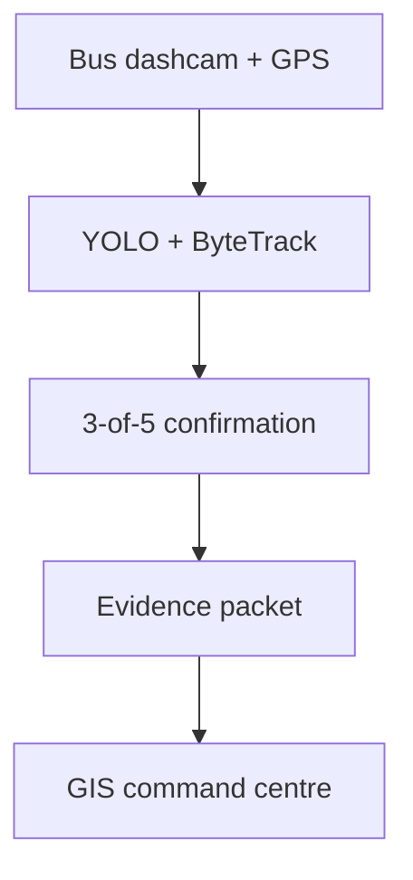

# DrishtiPath — Mobile Urban Intelligence Platform

An edge-first prototype for **Smart India Hackathon 2026 Problem Statement 26124**.
DrishtiPath turns public-transport dashcam footage into geotagged, reviewable urban
intelligence while transmitting evidence packets instead of continuous video.

> **Evidence policy:** this repository distinguishes implemented behaviour from roadmap
> claims. The included `yolov8n.pt` default is a generic traffic-object baseline. Real
> pothole, waterlogging, divider and crossing detection requires task-specific weights.

## What works now

| Capability | Implementation |
|---|---|
| Timestamp-based video/GPS alignment | Linear interpolation using `frame / FPS` |
| Edge perception | Any Ultralytics detection model |
| Object tracking | ByteTrack through Ultralytics track mode |
| False-alert suppression | Configurable N-of-M temporal confirmation, default 3/5 |
| Spatial deduplication | Haversine-radius merge for repeat observations |
| Evidence packaging | CSV events, context image, crop and metrics JSON |
| Command centre | One-upload runner, unified 3D operational map, review timeline and evidence |
| Bandwidth proof | Measured full-video bytes versus generated evidence bytes |
| ANPR | FastALPR ONNX pipeline with multi-frame tracking, GPS evidence and masked console output |
| Traffic analytics | Pretrained COCO YOLO + ByteTrack ROI occupancy and bottleneck heuristics |
| Edge export | NCNN/ONNX export with measured size and inference latency |

## Architecture



The edge node retains video locally and uploads only confirmed-event metadata and
evidence. Critical incidents may explicitly include a short clip; ordinary traffic
observations do not require full-video transfer.

## Quick start

Python 3.10 or newer is required.

```bash
python -m venv .venv
source .venv/bin/activate
python -m pip install --upgrade pip
pip install -r requirements.txt
```

On Windows PowerShell, activate with:

```powershell
.venv\Scripts\Activate.ps1
```

Run the edge pipeline against the included video and synthetic GPS route:

```bash
python orchestrator.py --classes car,person,bus,truck
```

Measure actual transfer reduction and launch the command centre:

```bash
python bandwidth_demo.py
streamlit run dashboard.py
```

Open the local URL printed by Streamlit, normally `http://localhost:8501`.

## One-upload dashboard workflow

The command centre can now create an isolated analysis session directly from a browser upload:

1. Run `streamlit run dashboard.py`.
2. Open **New scan** and drag in an MP4, MOV, AVI, or MKV dashcam clip.
3. Select **Synthetic demo route** or upload a real GPS CSV.
4. Choose **Quick scan** (road + traffic), **Full city scan** (road + traffic + ANPR),
   or a custom module combination.
5. Pass the displayed model/runtime preflight and click **Run DrishtiPath Scan**.
6. Review every successful module in the result tabs. A failed module does not discard
   evidence produced by the other modules.

Dashboard runs are stored under `artifacts/ui_runs/<run-id>/` with safe generated input names,
separate `road/`, `traffic/`, and `anpr/` outputs, and a `manifest.json` recording stage status.
The entire `artifacts/` tree remains ignored by Git. Uploads are limited to 500 MB and the
dashboard rejects unreadable videos and clips longer than 15 minutes.

The bundled `gps_data.csv` is always labelled **synthetic_demo**. Selecting real telemetry
requires a CSV with `timestamp` or `timestamp_s`, plus `lat`/`lon` or
`latitude`/`longitude` columns.

### 3D operational command centre

After a dashboard scan, open **3D command centre** for a unified digital-twin-style view:

- cyan path — time-ordered bus GPS trajectory;
- extruded amber/red columns — confirmed road hazards;
- teal columns — traffic-window occupancy and vehicle-density intensity;
- red alert markers — bottleneck episodes;
- blue review markers — privacy-masked ANPR evidence.

Column height is an operational intensity cue, **not physical object height**. The live renderer
uses Carto basemap tiles and therefore benefits from internet access. Select
**Offline-safe 3D** to use the tile-free Plotly renderer during unreliable venue connectivity.
Both renderers use the same tested, normalized scene data. Complete plate text is never copied
into the command-centre scene or timeline.

## Use a road-hazard model

The default COCO model does **not** detect potholes. Train or supply RDD2022-based weights
whose class names match the requested hazards:

### Official RDD2022 source

Download and extract the India subset from the official Road Damage Detector repository:

https://github.com/sekilab/RoadDamageDetector

RDD2022 covers **cracks and potholes** (`D00`, `D10`, `D20`, `D40`). It does **not** by itself
complete waterlogging, missing-divider or zebra-crossing detection. Those require separate
labelled datasets and model training.

### Prepare the YOLO dataset

After extracting the India VOC annotations locally:

```bash
python scripts/prepare_rdd2022.py \
  --source /path/to/extracted/RDD2022/India \
  --output datasets/rdd2022_india_yolo \
  --validation-ratio 0.20 \
  --seed 26124
```

This creates `images/`, `labels/`, and `data.yaml` under `datasets/rdd2022_india_yolo/`.

### Train locally

```bash
python train_road_hazard.py \
  --data datasets/rdd2022_india_yolo/data.yaml \
  --model yolov8n.pt \
  --epochs 50 \
  --imgsz 640 \
  --batch 16 \
  --workers 2 \
  --project runs/road_hazard \
  --name yolov8n_rdd2022_india \
  --seed 26124
```

### Recommended Google Colab / T4 GPU command

```bash
!pip install -q ultralytics
!python scripts/prepare_rdd2022.py --source /content/RDD2022/India --output datasets/rdd2022_india_yolo
!python train_road_hazard.py \
  --data datasets/rdd2022_india_yolo/data.yaml \
  --model yolov8n.pt \
  --epochs 50 \
  --imgsz 640 \
  --batch 16 \
  --device 0 \
  --workers 2 \
  --project runs/road_hazard \
  --name yolov8n_rdd2022_india_colab \
  --seed 26124
```

Copy the printed `best.pt` path locally after training. **Report model accuracy only from
validation output** (`precision`, `recall`, `mAP50`, `mAP50-95`). Do not substitute per-frame
detection confidence for dataset-level accuracy.

### Run the trained model in the edge pipeline

```bash
python orchestrator.py \
  --model path/to/best.pt \
  --classes pothole,longitudinal_crack,transverse_crack,alligator_crack
```

Legacy generic hazard names still work when your custom weights expose them directly:

```bash
python orchestrator.py \
  --model models/road_hazards.pt \
  --classes pothole,road_crack,waterlogging \
  --window-size 5 \
  --min-hits 3
```

## ANPR incident review

DrishtiPath integrates **MIT-licensed FastALPR** ONNX detection and OCR as the default ANPR
runtime. The pipeline performs multi-frame plate tracking, exact OCR consensus, timestamp-based
GPS attachment, and masked console output. Evidence files are written locally for authorized
human review only.

### Install

```bash
pip install -r requirements-anpr.txt
```

This installs `fast-alpr[onnx]==0.4.0` with ONNX Runtime. Model weights download on first run
and must not be committed to Git.

### Run

```bash
python anpr_pipeline.py \
  --input incident_clip.mp4 \
  --gps gps_data.csv \
  --gps-source-type synthetic_demo \
  --confidence 0.20 \
  --sample-fps 5 \
  --output-dir artifacts/anpr
```

Use `--show-plate-text` only for local debugging. Default console output masks plate text.
Set `--gps-source-type` explicitly to `synthetic_demo`, `real_telemetry`, or `unknown` —
GPS provenance is never inferred from the filename.

### Outputs

The selected artifact directory receives:

- `anpr_observations.csv` — every sampled plate observation with masked console-safe fields
- `anpr_events.json` — multi-frame plate tracks that pass the automated quality gate
- `anpr_result.json` — strongest confirmed event, or JSON `null` when none exist
- `metrics.json` — model names, provider, GPS source type, sampled frames, detections and timing
- `evidence/` — reviewable context frame and crop from the best observation per confirmed event

Every emitted event sets `requires_human_review: true` and `status: "pending_review"`.
`passes_automated_quality_gate` is `true` only when observation count, winning OCR votes,
mean OCR confidence and Indian/Bharat format checks all pass. Invalid-format OCR never
becomes a confirmed event (raw observations may still appear in the CSV).

### Validation limitations

- Functional smoke testing on a local clip is **not** an accuracy percentage.
- FastALPR region/country prediction is ignored for acceptance because it can be unstable on
  Indian footage.
- Label GPS with `--gps-source-type`; the bundled `gps_data.csv` is synthetic demo data, not
  real bus telemetry.
- This pipeline never attributes enforcement automatically — human review is always required.

### Privacy policy

- Complete plate text may appear only in local evidence artifacts under operator control.
- Console output masks plates by default.
- Do not commit clips, ONNX weights, artifacts, or plate evidence to Git.
- Do not transmit evidence automatically from this CLI.

## Traffic analytics

DrishtiPath can run a separate **pretrained COCO** traffic pass with Ultralytics YOLO and
ByteTrack. This module is independent of the road-hazard model and does not claim school-child
detection, calibrated road occupancy, or km/h speed estimates.

### Run

```bash
python traffic_analytics.py \
  --input clips/input_video.mp4 \
  --gps gps_data.csv \
  --gps-source-type synthetic_demo \
  --model yolov8n.pt \
  --output-dir artifacts/traffic_input_video \
  --confidence 0.25 \
  --frame-skip 3 \
  --window-seconds 5 \
  --roi 0.0,0.30,1.0,1.0 \
  --congestion-min-vehicles 6 \
  --congestion-min-occupancy 0.18 \
  --congestion-consecutive-windows 3
```

Supported vehicle classes: `car`, `motorcycle`, `bus`, `truck`, `bicycle`.
Person detections may be recorded separately. Set `--gps-source-type` explicitly to
`synthetic_demo`, `real_telemetry`, or `unknown`.

### Outputs

- `traffic_timeseries.csv` — fixed windows with mean/peak counts, occupancy, unique entries, GPS
- `traffic_summary.json` — configuration, totals, latency and documented limitations
- `bottleneck_events.csv` — congestion episodes with `status: pending_review` and
  `method: configurable_roi_heuristic`
- `traffic_detections.csv` — compact ROI detections for review
- `traffic_annotated.mp4` — ROI, boxes, track IDs, occupancy and congestion overlay

### Dashboard

```bash
streamlit run dashboard.py
```

Open the **Traffic analytics** tab and point the sidebar at the traffic output directory.
If artifacts are missing, the tab shows run instructions instead of failing. Synthetic GPS is
labelled clearly when `gps_source_type` is `synthetic_demo`.

### Limitations

- COCO provides generic vehicle/person classes only; it does **not** identify school children.
- ROI occupancy is an image-space proxy (clipped box area / ROI area), not real road occupancy.
- Unique counts depend on ByteTrack continuity and ignore untracked detections.
- Bottleneck detection is a configurable prototype heuristic, not a municipal traffic standard.
- Bundled `gps_data.csv` is synthetic demo data unless labelled otherwise via CLI.
- Real deployment needs camera calibration, real bus GPS and field validation.
- Do not estimate vehicle speed in km/h from pixels without calibration and reliable GPS speed.

## Edge model export and benchmarking

Export and benchmark Ultralytics models for ONNX or NCNN using reproducible warm-up, wall-time
measurements, artifact hashes and prediction parity. See [edge deployment guide](docs/EDGE_DEPLOYMENT.md).

```bash
python optimize_model.py \
  --model models/road_hazards.pt \
  --format onnx \
  --precision fp32 \
  --source clips/1.mp4 \
  --device cpu \
  --imgsz 640 \
  --sampling uniform \
  --warmup-runs 5 \
  --benchmark-frames 50 \
  --confidence 0.25 \
  --iou 0.70 \
  --report artifacts/edge_bench/road_hazards_onnx_fp32.json
```

NCNN FP16:

```bash
python optimize_model.py \
  --model models/road_hazards.pt \
  --format ncnn \
  --precision fp16 \
  --source clips/1.mp4 \
  --device cpu \
  --sampling uniform \
  --report artifacts/edge_bench/road_hazards_ncnn_fp16.json
```

INT8 ONNX export requires representative calibration YAML via `--data`. NCNN INT8 is rejected.
Deprecated `--int8` maps to `--precision int8`.

Reports include measured artifact sizes, SHA-256 hashes, inference and wall-time latency,
`measured_end_to_end_fps` (samples / total wall time), prediction parity and optional validation
metrics. Videos default to deterministic uniform sampling across the whole clip. Prediction
parity is not validation accuracy; a single matched detection is weak evidence.

`raspberry_pi_benchmarked` is detected automatically from Linux device-tree text when available
and is never set by a CLI override. Mac/desktop runs remain `false`. Even on a Pi, results apply
only to that machine (`hardware_scope: current_machine_only`).

View reports in the dashboard **Edge benchmark** tab.

## Live dashcam edge agent

`edge_agent.py` is the real-time runtime boundary for a USB/UVC dashcam, recorded route,
or RTSP source. It uses a bounded newest-frame buffer and one inference worker so slow
analytics never create an increasingly stale queue. Traffic and road-damage models run
at independent measured rates; an optional urban-assets model runs at a lower rate.

Recorded, real-time-paced route replay:

```bash
python edge_agent.py \
  --source clips/input_video.mp4 \
  --gps-csv gps_data.csv \
  --gps-source-type synthetic_demo \
  --profile desktop \
  --output-dir artifacts/edge_live/latest
```

Raspberry Pi camera example after confirming that the dashcam appears as `/dev/video0`:

```bash
python edge_agent.py \
  --source 0 \
  --gps-csv route_gps.csv \
  --gps-source-type real_telemetry \
  --profile pi4 \
  --road-model models/road_hazards_ncnn_model \
  --traffic-model models/traffic_ncnn_model \
  --device cpu \
  --output-dir artifacts/edge_live/pi-field-test
```

The `pi4`, `pi5`, and `desktop` rates are conservative configuration starting points,
not benchmark results. Each run writes actual per-model attempts and latency, captured
versus dropped analysis frames, memory, temperature, device identity from Linux
device-tree, and a computed single-worker load estimate. The dashboard **Live edge** tab
visualizes `device_status.json` and `metrics.json`.

Confirmed road or asset detections enter an atomic disk-backed outbox. Loss of 4G does
not discard evidence; network delivery and acknowledgement are intentionally a separate
adapter. No continuous video upload is performed by this runtime.

See [real-time edge deployment](docs/REALTIME_EDGE.md) for the scheduling contract,
dashcam checks, geofence format, artifacts, and honest claim boundary.

## Generated artifacts

`orchestrator.py` writes to `artifacts/latest/`:

- `annotated.mp4` — locally retained demonstration video
- `detections.csv` — every processed detection with box, track, GPS and video time
- `events.csv` — temporally confirmed and spatially deduplicated events
- `evidence/` — context frames and crops
- `metrics.json` — measured latency, throughput and payload sizes
- `bandwidth_report.json` — produced by `bandwidth_demo.py`

Generated outputs and model weights are intentionally ignored by Git.

## Verification

```bash
pip install -r requirements-dev.txt
pytest
ruff check .
```

The continuous-integration workflow checks syntax, unit tests and static quality on every
push and pull request.

## Current limitations

- Included GPS is synthetic and is clearly labelled as demo data.
- Standard `yolov8n.pt` demonstrates traffic objects, not road-condition classes.
- Raspberry Pi performance has not been claimed until the target-device report is saved.
- Live serial/NMEA GPS and remote outbox delivery adapters are not yet implemented; the
  live agent currently accepts timestamped GPS CSV replay or an explicitly labelled fixed
  demo coordinate.
- Real-time ANPR remains trigger-adapter work; the existing reviewed FastALPR pipeline is
  available for uploaded or retained incident clips.
- Hit-and-run classification is not inferred merely from a detected vehicle.
- Number plates and faces must follow authorization, retention and access-control policies.
- Origin–destination analytics requires multiple vehicles, route IDs and a larger dataset.

See [architecture details](docs/ARCHITECTURE.md) and the
[evaluation checklist](docs/EVALUATION.md).
