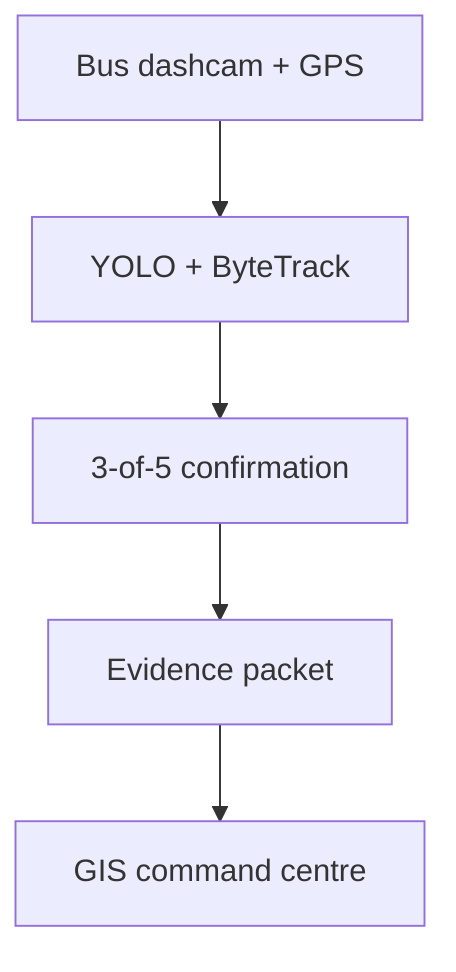

# DrishtiPath — Mobile Urban Intelligence Platform

An edge-first prototype for **Smart India Hackathon 2026 Problem Statement 26124**.
DrishtiPath turns public-transport dashcam footage into geotagged, reviewable urban
intelligence while transmitting evidence packets instead of continuous video.

> **Evidence policy:** this repository distinguishes implemented behaviour from roadmap
> claims. The included `yolov8n.pt` default is a generic traffic-object baseline. Real
> pothole, waterlogging, divider and crossing detection requires task-specific weights.

## What works now

| Capability | Implementation |
|---|---|
| Timestamp-based video/GPS alignment | Linear interpolation using `frame / FPS` |
| Edge perception | Any Ultralytics detection model |
| Object tracking | ByteTrack through Ultralytics track mode |
| False-alert suppression | Configurable N-of-M temporal confirmation, default 3/5 |
| Spatial deduplication | Haversine-radius merge for repeat observations |
| Evidence packaging | CSV events, context image, crop and metrics JSON |
| Command centre | Streamlit GIS map, filters, evidence review and system metrics |
| Bandwidth proof | Measured full-video bytes versus generated evidence bytes |
| ANPR | Dedicated plate-model pipeline with OCR voting and review threshold |
| Edge export | NCNN/ONNX export with measured size and inference latency |

## Architecture



The edge node retains video locally and uploads only confirmed-event metadata and
evidence. Critical incidents may explicitly include a short clip; ordinary traffic
observations do not require full-video transfer.

## Quick start

Python 3.10 or newer is required.

```bash
python -m venv .venv
source .venv/bin/activate
python -m pip install --upgrade pip
pip install -r requirements.txt
```

On Windows PowerShell, activate with:

```powershell
.venv\Scripts\Activate.ps1
```

Run the edge pipeline against the included video and synthetic GPS route:

```bash
python orchestrator.py --classes car,person,bus,truck
```

Measure actual transfer reduction and launch the command centre:

```bash
python bandwidth_demo.py
streamlit run dashboard.py
```

Open the local URL printed by Streamlit, normally `http://localhost:8501`.

## Use a road-hazard model

The default COCO model does **not** detect potholes. Supply trained weights whose class
names match the requested hazards:

```bash
python orchestrator.py \
  --model models/road_hazards.pt \
  --classes pothole,road_crack,waterlogging \
  --window-size 5 \
  --min-hits 3
```

Use an India-relevant labelled validation set and report precision, recall and false-alert
reduction before presenting accuracy to judges.

## ANPR incident review

ANPR requires a dedicated number-plate detector; generic YOLO vehicle boxes are not plate
boxes. Install the optional OCR dependencies and run it on a selected incident clip:

```bash
pip install -r requirements-anpr.txt
python anpr_pipeline.py \
  --input incident_clip.mp4 \
  --plate-model models/indian_plate_detector.pt
```

The result includes multi-frame vote count, combined confidence, Indian-format
plausibility and a `requires_human_review` flag. It is evidence assistance—not automatic
law-enforcement attribution.

## Edge model export

For Raspberry Pi, NCNN is the primary target. Benchmark on the actual device before making
performance claims:

```bash
python optimize_model.py --model yolov8n.pt --format ncnn --source bus.jpg
```

INT8 export requires representative calibration data:

```bash
python optimize_model.py \
  --model models/road_hazards.pt \
  --format ncnn \
  --int8 \
  --data datasets/road_hazards.yaml
```

## Generated artifacts

`orchestrator.py` writes to `artifacts/latest/`:

- `annotated.mp4` — locally retained demonstration video
- `detections.csv` — every processed detection with box, track, GPS and video time
- `events.csv` — temporally confirmed and spatially deduplicated events
- `evidence/` — context frames and crops
- `metrics.json` — measured latency, throughput and payload sizes
- `bandwidth_report.json` — produced by `bandwidth_demo.py`

Generated outputs and model weights are intentionally ignored by Git.

## Verification

```bash
pip install -r requirements-dev.txt
pytest
ruff check .
```

The continuous-integration workflow checks syntax, unit tests and static quality on every
push and pull request.

## Current limitations

- Included GPS is synthetic and is clearly labelled as demo data.
- Standard `yolov8n.pt` demonstrates traffic objects, not road-condition classes.
- Raspberry Pi performance has not been claimed until the target-device report is saved.
- Hit-and-run classification is not inferred merely from a detected vehicle.
- Number plates and faces must follow authorization, retention and access-control policies.
- Origin–destination analytics requires multiple vehicles, route IDs and a larger dataset.

See [architecture details](docs/ARCHITECTURE.md) and the
[evaluation checklist](docs/EVALUATION.md).
