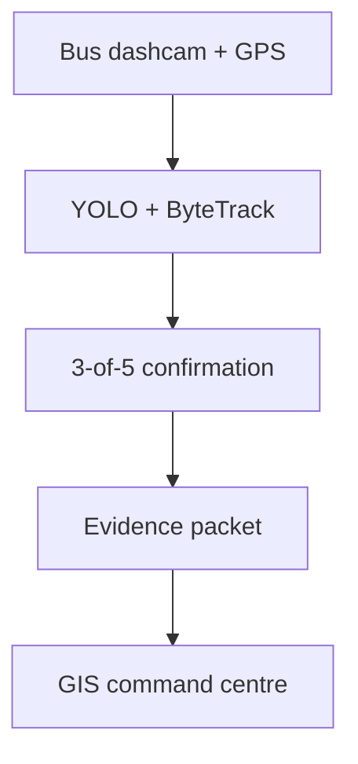

# DrishtiPath — Mobile Urban Intelligence Platform

An edge-first prototype for **Smart India Hackathon 2026 Problem Statement 26124**.
DrishtiPath turns public-transport dashcam footage into geotagged, reviewable urban
intelligence while transmitting evidence packets instead of continuous video.

> **Evidence policy:** this repository distinguishes implemented behaviour from roadmap
> claims. The included `yolov8n.pt` default is a generic traffic-object baseline. Real
> pothole, waterlogging, divider and crossing detection requires task-specific weights.

## What works now

| Capability | Implementation |
|---|---|
| Timestamp-based video/GPS alignment | Linear interpolation using `frame / FPS` |
| Edge perception | Any Ultralytics detection model |
| Object tracking | ByteTrack through Ultralytics track mode |
| False-alert suppression | Configurable N-of-M temporal confirmation, default 3/5 |
| Spatial deduplication | Haversine-radius merge for repeat observations |
| Evidence packaging | CSV events, context image, crop and metrics JSON |
| Command centre | Streamlit GIS map, filters, evidence review and system metrics |
| Bandwidth proof | Measured full-video bytes versus generated evidence bytes |
| ANPR | FastALPR ONNX pipeline with multi-frame tracking, GPS evidence and masked console output |
| Edge export | NCNN/ONNX export with measured size and inference latency |

## Architecture



The edge node retains video locally and uploads only confirmed-event metadata and
evidence. Critical incidents may explicitly include a short clip; ordinary traffic
observations do not require full-video transfer.

## Quick start

Python 3.10 or newer is required.

```bash
python -m venv .venv
source .venv/bin/activate
python -m pip install --upgrade pip
pip install -r requirements.txt
```

On Windows PowerShell, activate with:

```powershell
.venv\Scripts\Activate.ps1
```

Run the edge pipeline against the included video and synthetic GPS route:

```bash
python orchestrator.py --classes car,person,bus,truck
```

Measure actual transfer reduction and launch the command centre:

```bash
python bandwidth_demo.py
streamlit run dashboard.py
```

Open the local URL printed by Streamlit, normally `http://localhost:8501`.

## Use a road-hazard model

The default COCO model does **not** detect potholes. Train or supply RDD2022-based weights
whose class names match the requested hazards:

### Official RDD2022 source

Download and extract the India subset from the official Road Damage Detector repository:

https://github.com/sekilab/RoadDamageDetector

RDD2022 covers **cracks and potholes** (`D00`, `D10`, `D20`, `D40`). It does **not** by itself
complete waterlogging, missing-divider or zebra-crossing detection. Those require separate
labelled datasets and model training.

### Prepare the YOLO dataset

After extracting the India VOC annotations locally:

```bash
python scripts/prepare_rdd2022.py \
  --source /path/to/extracted/RDD2022/India \
  --output datasets/rdd2022_india_yolo \
  --validation-ratio 0.20 \
  --seed 26124
```

This creates `images/`, `labels/`, and `data.yaml` under `datasets/rdd2022_india_yolo/`.

### Train locally

```bash
python train_road_hazard.py \
  --data datasets/rdd2022_india_yolo/data.yaml \
  --model yolov8n.pt \
  --epochs 50 \
  --imgsz 640 \
  --batch 16 \
  --workers 2 \
  --project runs/road_hazard \
  --name yolov8n_rdd2022_india \
  --seed 26124
```

### Recommended Google Colab / T4 GPU command

```bash
!pip install -q ultralytics
!python scripts/prepare_rdd2022.py --source /content/RDD2022/India --output datasets/rdd2022_india_yolo
!python train_road_hazard.py \
  --data datasets/rdd2022_india_yolo/data.yaml \
  --model yolov8n.pt \
  --epochs 50 \
  --imgsz 640 \
  --batch 16 \
  --device 0 \
  --workers 2 \
  --project runs/road_hazard \
  --name yolov8n_rdd2022_india_colab \
  --seed 26124
```

Copy the printed `best.pt` path locally after training. **Report model accuracy only from
validation output** (`precision`, `recall`, `mAP50`, `mAP50-95`). Do not substitute per-frame
detection confidence for dataset-level accuracy.

### Run the trained model in the edge pipeline

```bash
python orchestrator.py \
  --model path/to/best.pt \
  --classes pothole,longitudinal_crack,transverse_crack,alligator_crack
```

Legacy generic hazard names still work when your custom weights expose them directly:

```bash
python orchestrator.py \
  --model models/road_hazards.pt \
  --classes pothole,road_crack,waterlogging \
  --window-size 5 \
  --min-hits 3
```

## ANPR incident review

DrishtiPath integrates **MIT-licensed FastALPR** ONNX detection and OCR as the default ANPR
runtime. The pipeline performs multi-frame plate tracking, exact OCR consensus, timestamp-based
GPS attachment, and masked console output. Evidence files are written locally for authorized
human review only.

### Install

```bash
pip install -r requirements-anpr.txt
```

This installs `fast-alpr[onnx]==0.4.0` with ONNX Runtime. Model weights download on first run
and must not be committed to Git.

### Run

```bash
python anpr_pipeline.py \
  --input incident_clip.mp4 \
  --gps gps_data.csv \
  --confidence 0.20 \
  --sample-fps 5 \
  --output-dir artifacts/anpr
```

Use `--show-plate-text` only for local debugging. Default console output masks plate text.

### Outputs

The selected artifact directory receives:

- `anpr_observations.csv` — every sampled plate observation with masked console-safe fields
- `anpr_events.json` — confirmed multi-frame plate tracks
- `anpr_result.json` — strongest confirmed event for backward compatibility
- `metrics.json` — model names, provider, sampled frames, detections and timing
- `evidence/` — reviewable context frame and crop per confirmed event

### Validation limitations

- Functional smoke testing on a local clip is **not** an accuracy percentage.
- FastALPR region/country prediction is ignored for acceptance because it can be unstable on
  Indian footage.
- The bundled `gps_data.csv` is synthetic demo data, not real bus telemetry.
- Confirmed events still require human review before any enforcement action.

### Privacy policy

- Complete plate text may appear only in local evidence artifacts under operator control.
- Console output masks plates by default.
- Do not commit clips, ONNX weights, artifacts, or plate evidence to Git.
- Do not transmit evidence automatically from this CLI.

## Edge model export

For Raspberry Pi, NCNN is the primary target. Benchmark on the actual device before making
performance claims:

```bash
python optimize_model.py --model yolov8n.pt --format ncnn --source bus.jpg
```

INT8 export requires representative calibration data:

```bash
python optimize_model.py \
  --model models/road_hazards.pt \
  --format ncnn \
  --int8 \
  --data datasets/road_hazards.yaml
```

## Generated artifacts

`orchestrator.py` writes to `artifacts/latest/`:

- `annotated.mp4` — locally retained demonstration video
- `detections.csv` — every processed detection with box, track, GPS and video time
- `events.csv` — temporally confirmed and spatially deduplicated events
- `evidence/` — context frames and crops
- `metrics.json` — measured latency, throughput and payload sizes
- `bandwidth_report.json` — produced by `bandwidth_demo.py`

Generated outputs and model weights are intentionally ignored by Git.

## Verification

```bash
pip install -r requirements-dev.txt
pytest
ruff check .
```

The continuous-integration workflow checks syntax, unit tests and static quality on every
push and pull request.

## Current limitations

- Included GPS is synthetic and is clearly labelled as demo data.
- Standard `yolov8n.pt` demonstrates traffic objects, not road-condition classes.
- Raspberry Pi performance has not been claimed until the target-device report is saved.
- Hit-and-run classification is not inferred merely from a detected vehicle.
- Number plates and faces must follow authorization, retention and access-control policies.
- Origin–destination analytics requires multiple vehicles, route IDs and a larger dataset.

See [architecture details](docs/ARCHITECTURE.md) and the
[evaluation checklist](docs/EVALUATION.md).
