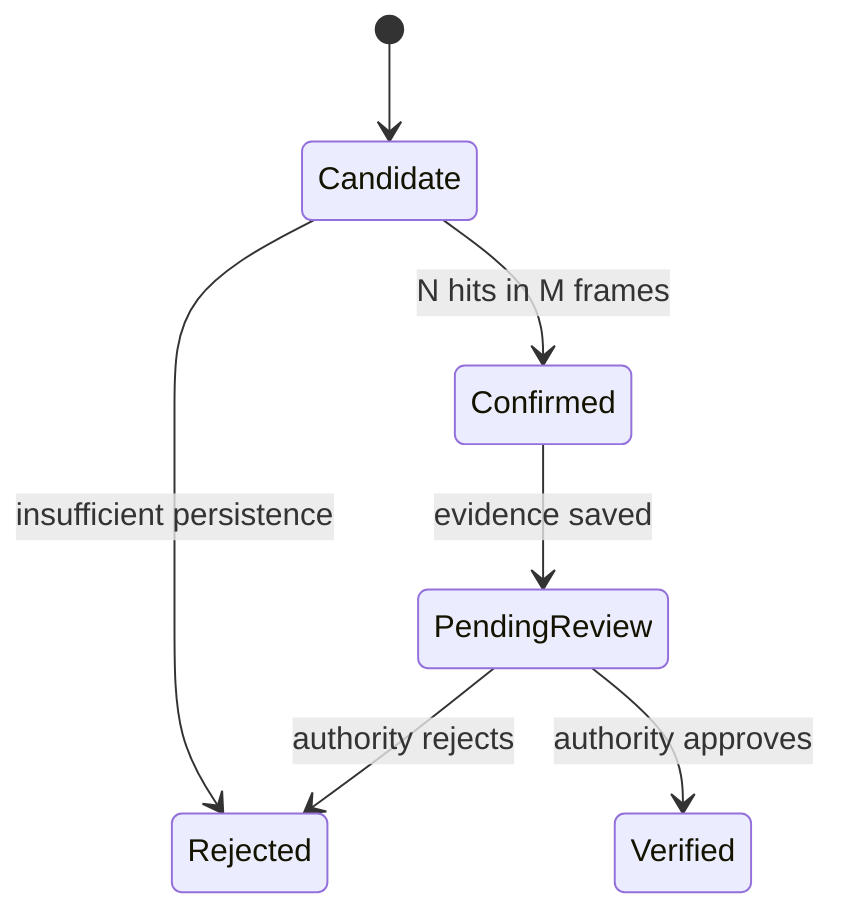

# Architecture and data contract

## Four-layer deployment

1. **Edge:** dashcam frames are sampled, inferred and tracked locally.
2. **Ingestion:** every processed frame is aligned to GPS by video timestamp.
3. **Intelligence:** temporal confirmation and spatial deduplication produce events.
4. **Command:** compact evidence packets are reviewed on a GIS dashboard.

## Event lifecycle

The current dashboard displays the `pending_review` stage. Persisting reviewer actions is
the next cloud/API milestone.

## Event fields

| Field | Meaning |
|---|---|
| `event_id` | Unique evidence identifier |
| `class` | Model class label |
| `confidence` | Mean confidence across confirming observations |
| `video_time_s` | Time relative to the start of the source video |
| `lat`, `lon` | GPS coordinate interpolated at video time |
| `temporal_hits` | Positive observations in the temporal window |
| `observation_count` | Spatially merged repeat observations |
| `status` | Human-review state |
| `evidence_frame` | Full contextual frame path |
| `evidence_crop` | Detected-region crop path |

## Deployment rule

Never label a generic object detection as a pothole or incident. The model class map and
validation report must travel with every deployed model version.
