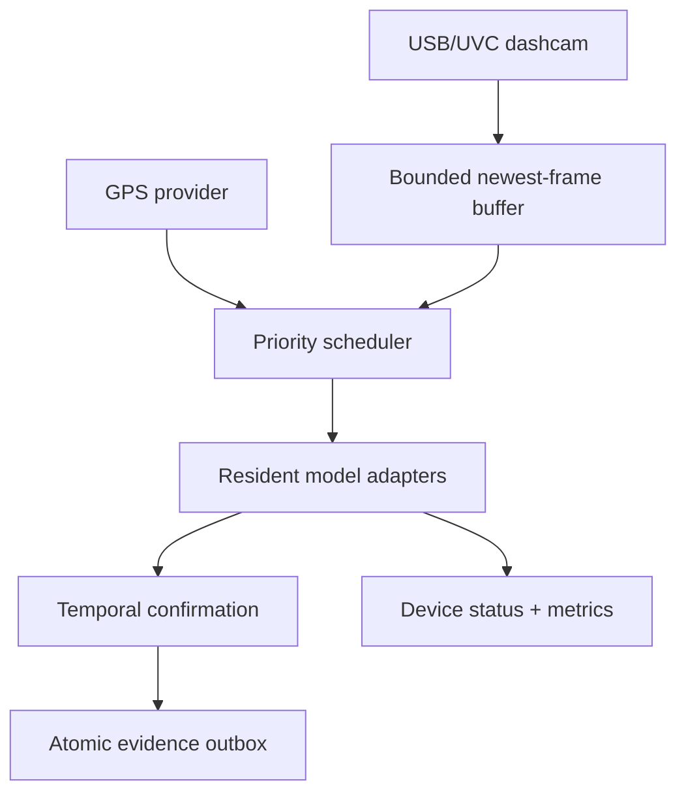

# Real-time edge deployment

`edge_agent.py` is the boundary between a live dashcam and DrishtiPath evidence. It is
designed to answer two separate questions honestly:

1. Can the camera capture continuously?
2. How many fresh frames can each analytics capability process on this device?

It never presents the camera capture rate as the AI inference rate.

## Runtime topology



The capture thread owns `VideoCapture`. The inference worker owns every model. This avoids
six Python processes independently loading large runtimes and competing for the CPU. If
inference falls behind, the buffer keeps the newest frame and records how many stale
analysis frames were dropped. Source recording, if required by policy, is a separate local
retention responsibility.

## Capability budget

| Capability | Current live state | Activation strategy |
|---|---|---|
| Traffic objects and persons | Implemented | Always, mixed rate |
| Road damage | Implemented | Always, mixed rate + 3-of-5 confirmation |
| Urban assets / waterlogging | Adapter implemented; custom weights required | Low-rate; geofence optimization next |
| Sign condition | Model not supplied | Cascade from a detected sign crop |
| Vulnerable pedestrian situation | Rule/model adapter next | School geofence + person track |
| ANPR | Existing reviewed clip pipeline | Incident-triggered burst adapter next |

The six capabilities must not run on every camera frame. Sign condition, vulnerable-risk
classification, and ANPR are cascade or event workloads. The runtime scheduler already
supports `always`, `geofenced`, and `triggered` activation; this release wires the three
general detection workloads and preserves explicit gaps for the remaining adapters.

## Dashcam preflight

Many consumer dashcams expose only storage when connected through USB. On Raspberry Pi,
confirm a live UVC device before changing application code:

```bash
v4l2-ctl --list-devices
ls -l /dev/video*
```

Use `--source 0` only when the camera appears as `/dev/video0`. Otherwise use a supported
HDMI-to-USB capture adapter, a CSI camera, an RTSP URL, or a recorded route replay labelled
as replay.

## GPS modes

Timestamped GPS replay or telemetry:

```bash
--gps-csv route_gps.csv --gps-source-type real_telemetry
```

Fixed coordinate for an explicitly labelled table demo:

```bash
--fixed-gps 28.6139,77.2090 --gps-source-type synthetic_demo
```

The fixed mode must never be described as real bus telemetry. Serial/NMEA ingestion is the
next provider adapter; GPS interpolation and provenance fields already use the shared core.

## Geofences

`--geofences config/geofences.example.json` accepts a list of objects:

```json
[
  {
    "key": "school-zone-demo",
    "latitude": 28.6139,
    "longitude": 77.209,
    "radius_m": 150
  }
]
```

The runtime records active context keys. Later triggered/cascade adapters use these keys to
avoid running school-zone or expected-asset logic across the whole route.

## Outputs

Each mission directory contains:

- `detections.ndjson` — compact geotagged observations from every scheduled model pass
- `events.ndjson` — temporally confirmed road/asset events only
- `evidence/` — context and crop JPEGs for confirmed events
- `outbox/pending/` — atomic evidence packets awaiting an authenticated uploader
- `device_status.json` — refreshable privacy-safe device telemetry
- `metrics.json` — final capture, scheduler, latency, error, queue and load report

The outbox stores no credentials and performs no transmission by itself. A future HTTPS or
MQTT adapter must acknowledge a packet before it moves from `pending/` to `sent/`.

## Tuning rule

For a single inference worker:

```text
estimated utilization = Σ(target FPS × measured mean latency ms) / 1000
```

If the result exceeds 1.0, the requested schedule is mathematically overloaded. In field
use, leave headroom for decoding, tracking, evidence encoding, temperature, and uploads.
Reduce target rates, resolution, or activation scope and run the same named-device test
again. Do not publish a Raspberry Pi FPS figure measured on a Mac or Colab GPU.
